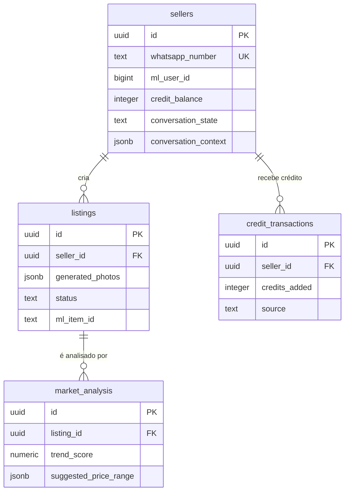

# Modelo de dados — protótipo

Camada de dados do bot de WhatsApp para vendedores do Mercado Livre.
Postgres (via Supabase), 4 tabelas. Definição canônica: [001_initial_schema.sql](../migrations/001_initial_schema.sql).

## Visão geral

Todas as FKs são `on delete cascade`: apagar um vendedor apaga seus anúncios,
transações e — em cascata pelos anúncios — as análises de mercado.

## `sellers`

Um vendedor/usuário de teste do bot. A identidade é o número de WhatsApp.

| Campo | Tipo | Notas |
|---|---|---|
| `id` | uuid PK | default `gen_random_uuid()` |
| `whatsapp_number` | text, not null, **unique** | Formato E.164, ex: `+5511999999999`. É por aqui que uma mensagem recebida vira um vendedor conhecido. |
| `ml_user_id` | bigint, nullable | ID do usuário no Mercado Livre. Preenchido só depois do OAuth (bloco d). |
| `ml_access_token` | text, nullable | Token de acesso do ML. Idem. |
| `ml_refresh_token` | text, nullable | Token de refresh do ML. Idem. |
| `ml_token_expires_at` | timestamptz, nullable | Quando o access token expira — usado para decidir o refresh. |
| `credit_balance` | integer, not null, default `0` | Saldo atual de créditos. Check: não pode ficar negativo. No protótipo é liberado à mão. |
| `conversation_state` | text, not null, default `'novo'` | Estado da máquina de conversa. Valores esperados: `novo`, `aguardando_geracao`, `aguardando_aprovacao`, `aguardando_oauth_ml`, `publicando`. Text simples, não enum: os estados ainda vão mudar durante o protótipo. |
| `conversation_context` | jsonb, not null, default `'{}'` | Dados temporários da conversa em andamento (ex: url da última foto recebida, id do listing em edição). |
| `created_at` | timestamptz, not null, default `now()` | |
| `updated_at` | timestamptz, not null, default `now()` | Atualizado automaticamente por trigger a cada `UPDATE`. |

Índice: `whatsapp_number`.

## `listings`

Um anúncio sendo gerado/publicado. Nasce quando o vendedor manda a foto e
acompanha todo o ciclo até virar item publicado no ML.

| Campo | Tipo | Notas |
|---|---|---|
| `id` | uuid PK | default `gen_random_uuid()` |
| `seller_id` | uuid FK → `sellers.id`, not null | `on delete cascade` |
| `original_photo_url` | text, nullable | Foto que o vendedor mandou pelo WhatsApp. |
| `generated_photos` | jsonb, not null, default `'[]'` | Array de objetos `{url, scene, is_cover}` — as 8 fotos geradas. `is_cover` marca a foto de capa do anúncio. |
| `generated_title` | text, nullable | Título gerado. |
| `generated_description` | text, nullable | Descrição gerada. |
| `ml_category_id` | text, nullable | Categoria do Mercado Livre sugerida/escolhida (ex: `MLB1234`). |
| `success_score` | integer, nullable | Score de sucesso mostrado ao vendedor. Check: entre 0 e 100 quando presente. |
| `status` | text, not null, default `'rascunho'` | Valores esperados: `rascunho`, `aprovado`, `publicado`. |
| `ml_item_id` | text, nullable | ID do item no ML. Preenchido depois da publicação (bloco d). |
| `created_at` | timestamptz, not null, default `now()` | |
| `updated_at` | timestamptz, not null, default `now()` | Atualizado automaticamente por trigger. |

Índice: `seller_id`.

## `credit_transactions`

Histórico de crédito liberado. Append-only: cada linha é um evento de crédito,
e `sellers.credit_balance` é o saldo corrente.

| Campo | Tipo | Notas |
|---|---|---|
| `id` | uuid PK | default `gen_random_uuid()` |
| `seller_id` | uuid FK → `sellers.id`, not null | `on delete cascade` |
| `amount_paid` | numeric(10,2), nullable | Valor pago em reais. Null quando a origem é manual/teste. |
| `credits_added` | integer, not null | Quantos créditos a transação adicionou. |
| `pix_payment_id` | text, nullable | ID do pagamento Pix. |
| `source` | text, not null, default `'manual_test'` | Valores esperados: `manual_test`, `pix`. |
| `status` | text, not null, default `'completed'` | |
| `created_at` | timestamptz, not null, default `now()` | |

Índice: `seller_id`.

> **Nota:** `credit_transactions.pix_payment_id` e `amount_paid` existem para
> suportar cobrança via Pix numa fase futura — não usados no protótipo atual.
> Nesta fase toda linha tem `source = 'manual_test'`, com os dois campos nulos.

## `market_analysis`

Resultado da análise de mercado + score, por anúncio. Um anúncio pode ter mais
de uma análise ao longo do tempo (regeração, reanálise); a mais recente é a que
vale, por `created_at`.

| Campo | Tipo | Notas |
|---|---|---|
| `id` | uuid PK | default `gen_random_uuid()` |
| `listing_id` | uuid FK → `listings.id`, not null | `on delete cascade` |
| `trend_score` | numeric, nullable | Sinal de tendência de busca/demanda do produto. |
| `competition_level` | text, nullable | Nível de concorrência (ex: `baixa`, `media`, `alta`). |
| `suggested_price_range` | jsonb, nullable | Ex: `{"min": 10, "max": 20}`. |
| `rationale_text` | text, nullable | Explicação legível do score, mostrada ao usuário no WhatsApp. |
| `created_at` | timestamptz, not null, default `now()` | |

Índice: `listing_id`.

## Fora do escopo desta fase

- **RLS/policies:** nenhuma policy foi configurada. Ver o aviso de segurança no [README](../README.md).
- **Enums:** os campos de estado (`conversation_state`, `status`, `source`) são
  `text` livre. Viram enum ou `check` fechado quando os valores estabilizarem.
