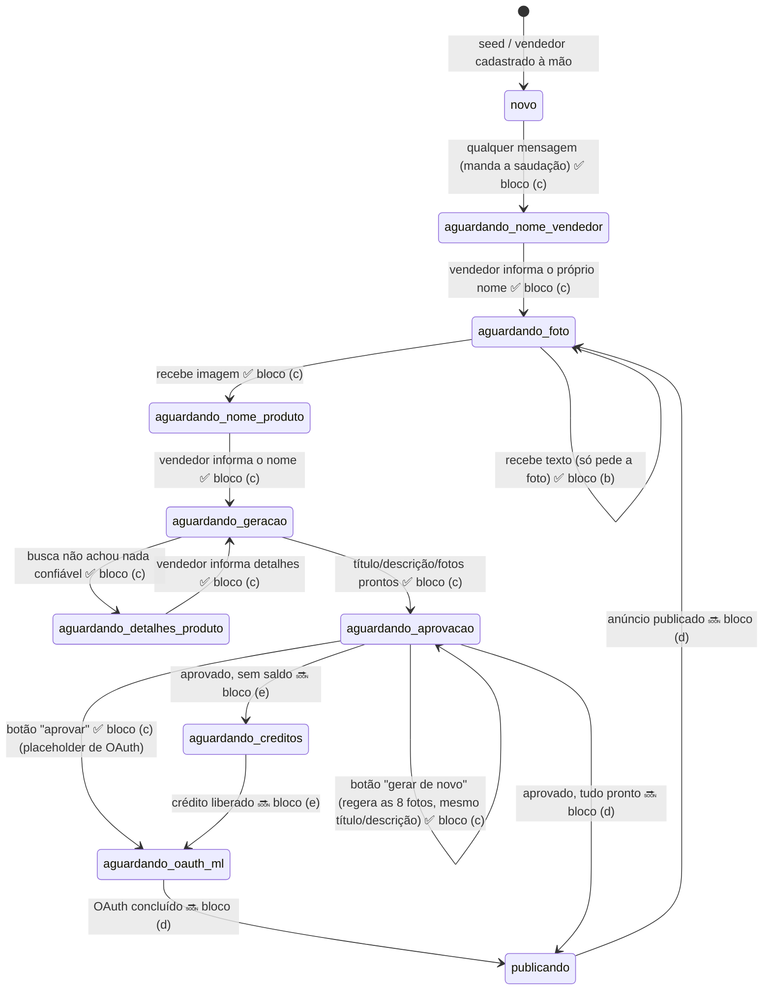

# Máquina de estados da conversa

O estado vive em `sellers.conversation_state` (text) e os dados temporários da
conversa em `sellers.conversation_context` (jsonb), como definido em
[docs/data-model.md](data-model.md).

> **Bloco (c): todas as transições abaixo até `aguardando_aprovacao` (e as 3
> saídas de `aguardando_aprovacao`) já existem de verdade.** O que ainda é
> placeholder: `aguardando_oauth_ml` e `publicando` (bloco d), e edição manual
> real do título/descrição.

## Diagrama



Legenda: ✅ implementado · 🔜 planejado

`aguardando_geracao` aparece duas vezes no diagrama (ida e volta) porque, na
prática, ele é só um estado de trânsito: o vendedor nunca fica "parado" nele
esperando alguém digitar algo — ou a execução segue direto pra
`aguardando_detalhes_produto` (se a busca não achou nada confiável) ou direto
pra `aguardando_aprovacao` (se achou, ou se o vendedor acabou de informar os
detalhes). Ver [README](../README.md), seção do bloco (c), pro fluxo completo
passo a passo.

## Estados

| Estado | O que significa | Entra quando | Sai quando | Bloco responsável | Hoje |
|---|---|---|---|---|---|
| `novo` | Vendedor liberado mas que nunca falou com o bot — ainda não disse o nome dele | Valor default do schema | Qualquer mensagem chega (bot manda a saudação) | **(c)** | ✅ implementado |
| `aguardando_nome_vendedor` | Saudação enviada; esperando o vendedor dizer como quer ser chamado | Qualquer mensagem em `novo` | Vendedor responde (texto vira `sellers.name`) | **(c)** | ✅ implementado |
| `aguardando_foto` | Ocioso. Sem anúncio em andamento; esperando uma foto. Volta aqui depois de publicar | Vendedor informou o nome | Chega uma imagem | **(b)/(c)** | ✅ implementado |
| `aguardando_nome_produto` | Foto já baixada e salva; esperando o vendedor informar o nome do produto | Imagem recebida em `aguardando_foto` | Vendedor responde com o nome | **(c)** | ✅ implementado |
| `aguardando_geracao` | Nome/detalhes recebidos; buscando informação real, gerando título/descrição/fotos | Nome ou detalhes do produto informados | Geração termina (→ `aguardando_aprovacao`) ou busca não confiável (→ `aguardando_detalhes_produto`) | **(c)** | ✅ implementado (é um estado de trânsito — ver nota acima) |
| `aguardando_detalhes_produto` | A busca não achou informação confiável sobre o produto; esperando o vendedor descrever as características | Busca sem `groundingChunks` / sem texto | Vendedor responde com os detalhes | **(c)** | ✅ implementado |
| `aguardando_aprovacao` | Anúncio (título + descrição + 8 fotos) enviado; esperando um dos 3 botões (aprovar / gerar de novo / editar) | Geração conclui | Usuário responde com um botão | **(c)** | ✅ implementado (as 3 transições respondem; "aprovar" e "editar" levam a placeholders dos blocos d/futuro) |
| `aguardando_creditos` | Aprovado, mas sem saldo para publicar | Aprovação sem `credit_balance` suficiente | Crédito liberado | **(e)** | placeholder |
| `aguardando_oauth_ml` | Falta ligar a conta do Mercado Livre | Botão "aprovar" em `aguardando_aprovacao` | Callback do OAuth grava os tokens | **(d)** | entra (placeholder), não sai ainda |
| `publicando` | Publicação no ML em andamento | Tudo pronto e aprovado | ML devolve o `ml_item_id` | **(d)** | placeholder |
| *(qualquer outro)* | Estado inesperado — bug ou schema em evolução | — | — | — | placeholder de "não reconheço" |

**`aguardando_oauth_ml` é um beco sem saída hoje**: a transição de entrada é
real (o botão "aprovar" grava e muda o estado), mas nada implementa a saída
até o bloco (d). Para destravar um vendedor de teste (de qualquer estado):

```sql
update sellers set conversation_state = 'novo' where whatsapp_number = '+55...';
```

## Comando global `menu` — fora da máquina de estados

Antes de qualquer roteamento por `conversation_state`, o node
`rotear-comando-global` intercepta comandos que valem em **qualquer** estado:

| Entrada | O que faz | Mexe no estado? |
|---|---|---|
| texto `menu` (minúsculo, sem espaços) | manda a lista interativa | não |
| linha `menu_recomecar` | `conversation_state = 'aguardando_foto'` | **sim** |
| linha `menu_como_funciona` | manda o passo a passo | não |
| linhas `menu_*_embreve` | manda "ainda não disponível" | não |
| qualquer outra coisa | cai no fallback `fluxo_normal` → `rotear-por-estado` | — |

Isso existe porque a máquina de estados tem becos: um vendedor parado em
`aguardando_aprovacao` esperando o clique de um botão não era reconhecido ao
mandar texto, e só saía de lá com `UPDATE` manual no banco. `menu` → *Recomeçar*
é esse `UPDATE`, na mão do próprio vendedor.

*Recomeçar* volta pra `aguardando_foto`, não pra `novo`, de propósito: `novo`
dispararia a saudação e a pergunta do nome de novo, e o vendedor já tem
`sellers.name` preenchido. `conversation_context` é deixado como está — o próximo
envio de foto cria uma listing nova e o context é reescrito inteiro adiante.

## Notas de implementação

- **`novo` mudou de significado.** Antes era "ocioso, esperando foto"; agora é
  "vendedor liberado que nunca conversou com o bot". Quem faz o papel antigo é
  `aguardando_foto`. Consequência prática: para reapresentar a saudação a um
  vendedor de teste, mande-o de volta pra `novo`; para pular a saudação e só
  testar a geração, use `aguardando_foto`.

  ```sql
  -- refazer o onboarding do zero (saudação + nome + boas-vindas)
  update sellers set conversation_state = 'novo', name = null
   where whatsapp_number = '+55...';

  -- pular direto pra "manda a foto"
  update sellers set conversation_state = 'aguardando_foto'
   where whatsapp_number = '+55...';
  ```

- **O nome do vendedor mora em `sellers.name`** (coluna adicionada em
  `migrations/002_seller_name.sql`), não em `conversation_context` — o context
  é reescrito inteiro (`jsonb_build_object`) em `atualizar-estado-nome-produto`
  e `atualizar-estado-aprovacao`, então o nome se perderia no meio do fluxo.
  Quem grava é o node `salvar-nome-vendedor` (não confundir com
  `salvar-nome-produto`, que é o nome do PRODUTO, bem mais adiante).

- **`aguardando_nome_produto` e `aguardando_detalhes_produto` são novos no
  bloco (c).** Como as demais, ficam de fora do comentário do schema em
  [001_initial_schema.sql](../migrations/001_initial_schema.sql) (lista os
  estados do bloco a) — coluna `text` livre, não precisa migration.
- **`conversation_context` passou a ser usado no bloco (c).** Guarda, ao longo
  da conversa: `listing_id`, `original_photo_storage_url` (setados assim que a
  foto é baixada e salva no Storage, antes até de perguntar o nome — ver
  próxima nota) e `nome_produto` (setado quando o vendedor responde). É o que
  permite a execução "pausar" esperando uma resposta de texto e, na próxima
  mensagem, continuar de onde parou sem perder o que já foi coletado — e o que
  permite o botão "gerar de novo" não pedir a foto nem o nome de volta.
- **A foto é baixada e salva no Storage assim que chega, antes de perguntar o
  nome do produto** — não no fim do fluxo. Motivo: a URL temporária que a Meta
  devolve pro binário da foto expira em poucos minutos, mas entre a foto
  chegar e o vendedor responder o nome do produto pode passar bem mais que
  isso (é uma pausa esperando resposta humana, sem tempo previsível). Uma URL
  do Supabase Storage não expira, então o download acontece uma vez só, cedo,
  e tudo depois disso (inclusive um eventual "gerar de novo") lê a foto do
  Storage, nunca da Meta de novo.
- **A transição não é atômica** em nenhum ponto do fluxo: cada etapa
  (criar listing, baixar/salvar foto, salvar nome, gerar título/descrição,
  gerar fotos, salvar no Storage) é um node Postgres/Code separado; se um
  falhar no meio, sobra estado parcial (ex: `listing` com título mas sem
  fotos). Aceitável no protótipo; vira transação só quando o fluxo passar a
  mexer em crédito.
- **Não há timeout de estado.** Um vendedor que trave em qualquer estado
  intermediário (ex: `aguardando_nome_produto`, se nunca responder) fica lá
  até alguém rodar o UPDATE acima.
