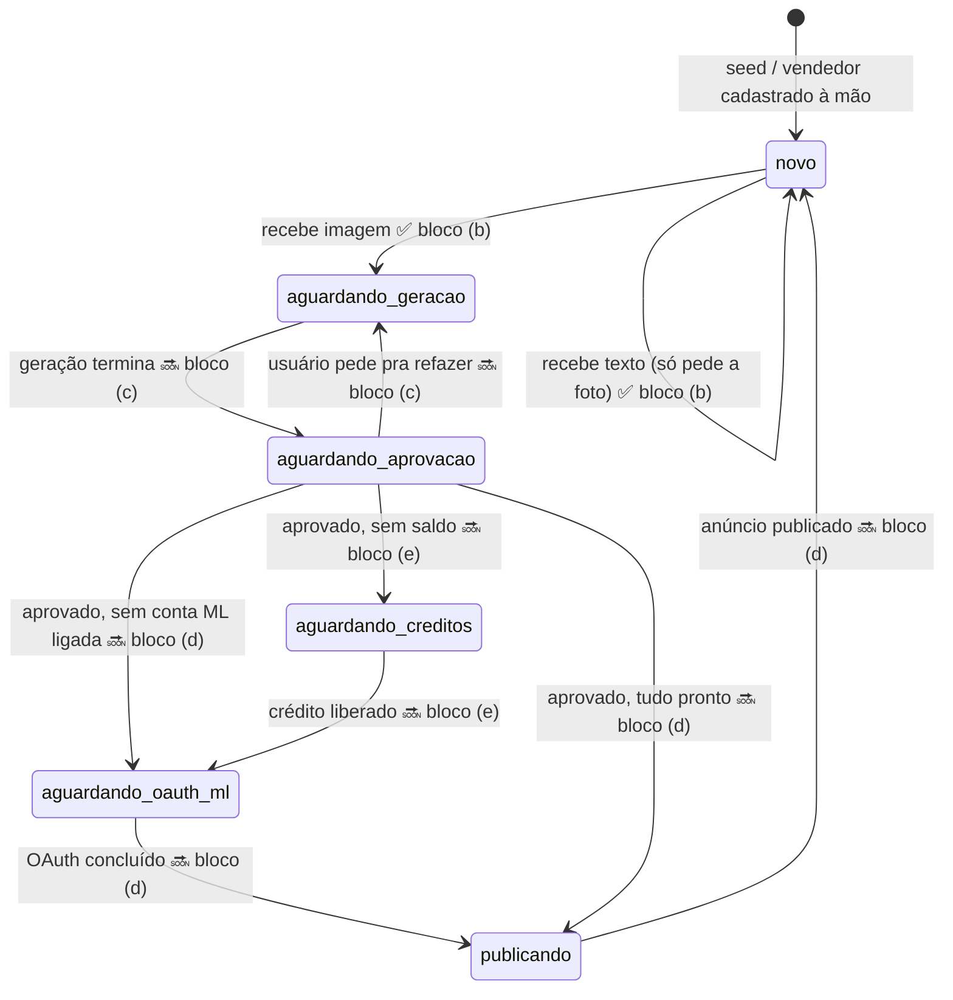

# Máquina de estados da conversa

O estado vive em `sellers.conversation_state` (text) e os dados temporários da
conversa em `sellers.conversation_context` (jsonb), como definido em
[docs/data-model.md](data-model.md).

> **Hoje só existe de verdade a transição `novo → aguardando_geracao`.** Todo o
> resto deste documento é o plano: os outros estados existem no roteador do
> workflow apenas para responder um placeholder honesto, e nenhum deles é
> alcançável, porque nada escreve esses valores no banco ainda.

## Diagrama



Legenda: ✅ implementado · 🔜 planejado

## Estados

| Estado | O que significa | Entra quando | Sai quando | Bloco responsável | Hoje |
|---|---|---|---|---|---|
| `novo` | Ocioso. Sem anúncio em andamento; esperando uma foto. | Valor default do schema; volta aqui depois de publicar | Chega uma imagem | **(b)** | ✅ implementado |
| `aguardando_geracao` | Foto recebida, geração de fotos/título/descrição/score rodando | Imagem recebida em `novo` | Geração termina e o resultado é enviado | **(c)** | ⚠️ entra, mas não sai |
| `aguardando_aprovacao` | Resultado enviado; esperando o "aprovo" ou "refaz" | Geração conclui | Usuário responde | **(c)** | placeholder |
| `aguardando_creditos` | Aprovado, mas sem saldo para publicar | Aprovação sem `credit_balance` suficiente | Crédito liberado | **(e)** | placeholder |
| `aguardando_oauth_ml` | Falta ligar a conta do Mercado Livre | Aprovação com `sellers.ml_access_token` nulo/expirado | Callback do OAuth grava os tokens | **(d)** | placeholder |
| `publicando` | Publicação no ML em andamento | Tudo pronto e aprovado | ML devolve o `ml_item_id` | **(d)** | placeholder |
| *(qualquer outro)* | Estado inesperado — bug ou schema em evolução | — | — | — | placeholder de "não reconheço" |

**`aguardando_geracao` é um beco sem saída hoje**, e isso é intencional: a
transição de entrada é real (grava `listings` e muda o estado), mas nada
implementa a saída até o bloco (c). Quem mandar uma foto e depois outra mensagem
recebe o placeholder de etapa avançada. Para destravar um vendedor de teste:

```sql
update sellers set conversation_state = 'novo' where whatsapp_number = '+55...';
```

## Notas de implementação

- **`aguardando_creditos` é novo neste bloco.** O comentário do schema em
  [001_initial_schema.sql](../migrations/001_initial_schema.sql) lista os estados
  previstos no bloco (a) e não inclui esse valor. Como a coluna é `text` livre,
  não é preciso migration — mas quando os estados estabilizarem e virarem um
  `check`/enum, esse valor precisa entrar na lista.
- **`conversation_context` ainda não é usado.** Nenhum node deste bloco escreve
  nele. A partir do bloco (c) ele guarda o que a conversa precisa carregar entre
  mensagens (ex: `listing_id` em edição).
- **A transição não é atômica.** `criar-listing` e `atualizar-estado` são dois
  nodes Postgres separados; se o segundo falhar, sobra um `listing` órfão com o
  vendedor ainda em `novo`. Aceitável no protótipo (o pior caso é uma linha a
  mais e o usuário reenviar a foto); vira uma transação só quando o fluxo passar
  a mexer em crédito.
- **Não há timeout de estado.** Um vendedor que trave em `aguardando_geracao`
  fica lá até alguém rodar o UPDATE acima.
